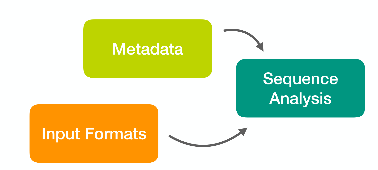

# Lotus tutorial

[Lotus](http://psbweb05.psb.ugent.be/lotus/) is a suite of tools to automatically end efficiently analyze 16S datasets.

This repository contains some documentation and hands out notes (see below), as well as three datasets to practice with (in the [datasets](datasets/) subdirectory).

This workshop focuses on a common triad of tasks: dealing with different input formats/technologies, propagating and making use of metadata (mapping files), and performing the 16S analysis itself.

[](docs/slides.pdf)

## 16S analysis with Lotus

If you need help connecting to a remote server, see  "[Connecting to a Linux server (ssh)](https://seq.space/notes/doku.php?id=bash-ssh)". If you use the EI training VM, you will find the lotus-training-master.zip archive in the ~/lotus_pipeline folder. Extract it with:
```
mkdir ~/16S/
unzip ~/lotus_pipeline/lotus-tutorial-master.zip -d ~/16S/
```

Please, keep an eye at the **documentation** section below.

#### :baby: First steps: running lotus

To begin your journey try running Lotus, first with default parameters then tweaking its behaviour

 * [Running Lotus](workshop/lotus.md)
   * [Installing Lotus](https://youtu.be/dr9wyotaolI)
   * [Running Lotus](https://youtu.be/UP2tJQQIeBo)
 
#### :open_file_folder: Preparing input from different sources

Sadly, a big part of the 16S analysis pipelines is related to managing different file inputs and formats. If you plan to analyze datasets downloaded from (sometimes old) papers, try these:

 * [Demultiplex a 454 run](workshop/demux_454.md)
 * [Manual demultiplex an Illumina run](workshop/demux_illumina.md)
 
#### :sunglasses: Becoming a pro

This section contains a couple of more advanced topics:

 * [Create a custom taxonomical database](workshop/customdb.md)
 * [Detect the target region](workshop/detect.md)
 
#### :mag: Try each step manually

If you want to refresh the concepts presented, try a simplified workflow manually:

 * [Manual USEARCH analysis](workshop/usearch.md)

##  Documentation
 * :page_facing_up: [Lotus manual](docs/lotus.md)
 * :page_facing_up: [sdm (simple demultiplexer) manual](docs/sdm.md)
 * :movie_camera: [slides](docs/slides.pdf)
