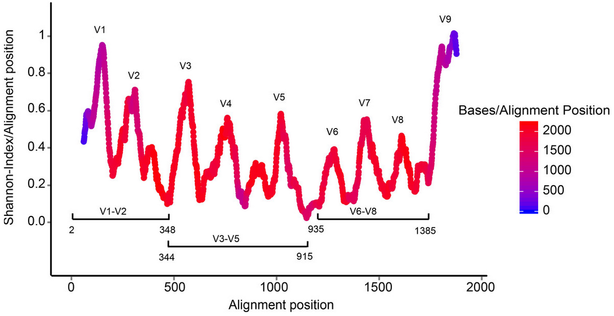

# What region was sequenced?

A 16S experiment can target one or more hypervariable regions, usually depending on the read length achievable by the sequencing technology used.

To detect what region a sequence (or a small set of sequences) cover you can use the script _detect\_region.pl_ from the repository [16S-Region](https://github.com/telatin/16s-region).

### Credits
Picture from [this presentation](https://www.slideshare.net/beiko/ccbc-tutorial-beiko)
